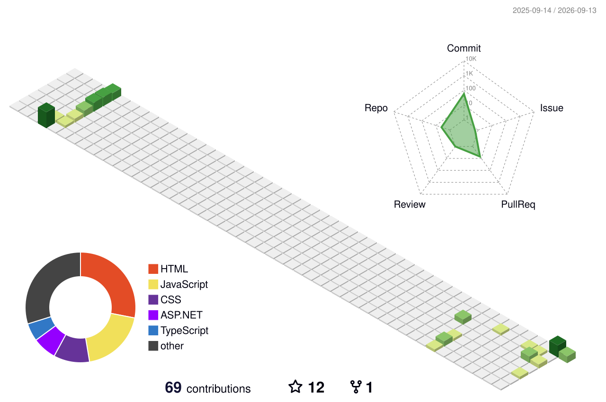

<!-- Animated SVGs are self-contained: no JavaScript or video player required. -->
<picture>
  <source media="(prefers-color-scheme: dark)" srcset="https://raw.githubusercontent.com/Sandhit06/Sandhit06/master/dark.svg?v=4">
  <source media="(prefers-color-scheme: light)" srcset="https://raw.githubusercontent.com/Sandhit06/Sandhit06/master/light.svg?v=4">
  
</picture>

  <a href="https://www.linkedin.com/in/sandhit-karmakar/">LinkedIn</a> &nbsp;·&nbsp;
  <a href="mailto:sandhitkarmakar@gmail.com">Email</a> &nbsp;·&nbsp;
  <a href="https://leetcode.com/u/sandhit_06/">LeetCode</a> &nbsp;·&nbsp;
  <a href="https://github.com/Sandhit06?tab=repositories">All repositories</a>

### About me

I'm **Sandhit**, a software engineer interested in backend systems, cloud infrastructure, and useful AI applications. I enjoy connecting the pieces—from APIs and databases to the interface people use—and making them easier to understand, test, and maintain.

B.Tech in Computer Science **(AI & ML)** from **VIT Chennai**. Away from code: table tennis, gaming, and cosmology.

### Selected projects

<table>
<tr>
<td width="50%" valign="top">
<h3><a href="https://github.com/Sandhit06/QueryLens_AI">QueryLens AI ↗</a></h3>

A conversational interface for exploring datasets, with answer validation and integration with a separate FastAPI service.

<code>React</code> <code>Python / FastAPI</code> <code>Clerk</code>

</td>
<td width="50%" valign="top">
<h3><a href="https://github.com/Sandhit06/Distributed-Bank">Distributed Bank ↗</a></h3>

A banking microservices sample exploring service boundaries, messaging, API gateways, and resilience patterns.

<code>.NET</code> <code>gRPC</code> <code>RabbitMQ</code>

</td>
</tr>
<tr>
<td width="50%" valign="top">
<h3><a href="https://github.com/Sandhit06/Interview-Platform-Using-React-Next.js">CodeNexus ↗</a></h3>

An interview platform with video calls, screen sharing, recording, and authenticated interview workflows.

<code>Next.js</code> <code>TypeScript</code> <code>Stream</code>

</td>
<td width="50%" valign="top">
<h3><a href="https://github.com/Sandhit06/OrderFlow">OrderFlow ↗</a></h3>

An order-processing learning project exploring idempotency, transactional messaging, inventory, and failure recovery.

<code>Java / Spring Boot</code> <code>Kafka</code> <code>PostgreSQL</code>

</td>
</tr>
</table>

### Technology I work with

| Area | Tools |
| :--- | :--- |
| Languages | Java · Python · C# · TypeScript · Dart |
| Backend | Spring Boot · ASP.NET Core · FastAPI · Node.js |
| Frontend & mobile | React · Next.js · Flutter |
| Data & messaging | PostgreSQL · MongoDB · Redis · Kafka · RabbitMQ |
| Cloud & development | AWS · Docker · Git · Postman |

### Contribution activity

<picture>
  <source media="(prefers-color-scheme: dark)" srcset="./profile-3d-contrib/profile-night-view.svg">
  <source media="(prefers-color-scheme: light)" srcset="./profile-3d-contrib/profile-green.svg">
  
</picture>

<b>Problem solving & more</b>

 
<picture>
  <source media="(prefers-color-scheme: dark)" srcset="https://leetcard.jacoblin.cool/sandhit_06?theme=dark&amp;font=Source%20Code%20Pro&amp;ext=contest">
  
</picture>

[LeetCode profile](https://leetcode.com/u/sandhit_06/) · [DEV Community](https://dev.to/sandhit06) · [Stack Overflow](https://stackoverflow.com/users/22609588) · [X](https://twitter.com/sandhitk) · [Instagram](https://www.instagram.com/rizdhitz/)

[What I'm listening to on Spotify](https://spotify-github-profile.kittinanx.com/api/view?uid=uden22m7keq52iqa3zonzjr0y&redirect=true) · [daily.dev](https://app.daily.dev/sandhit06)

---

Building, learning, and shipping. One project at a time.

