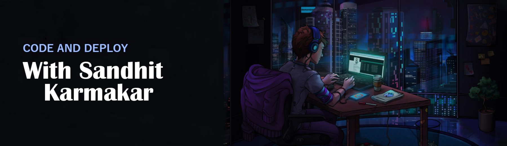
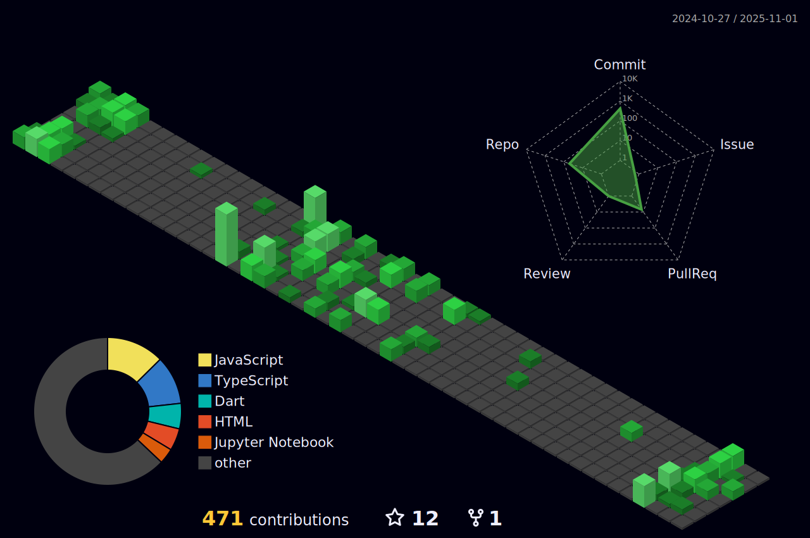

<div align="center">
<a href="https://git.io/typing-svg"></a>
</div>

<h3 align="center">Developer with No Rizzz !</h3>

<p align="left">  </p>


```yaml
Name: Sandhit Karmakar
Pronouns: He/Him
Occupation: Student
Branch: Computer Science Engineering Spec. AI & ML
University: Vellore Institute of Technology, Chennai
Location: Chennai
Interests: Cybersecurity, Cosmology
Currently-Learning: React
Hobbies: Table Tennis, PS5
Ask me about: Android Development
Reach-me-at: sandhitkarmakar@gmail.com
```

<h2 align="left">🧑🏻‍💻 &nbsp; Connect with me 
  
</h2> 

<div align="left">
  <a href="https://dev.to/sandhit06" target="blank">
    
  </a>
  <a href="https://twitter.com/sandhitk" target="blank">
    
  </a>
  <a href="https://linkedin.com/in/sandhit-karmakar" target="blank">
    
  </a>
  <a href="https://stackoverflow.com/users/22609588" target="blank">
    
  </a>
  <a href="https://www.leetcode.com/sandhit_06" target="blank">
    
  </a>
  <a href="https://www.instagram.com/rizdhitz/" target="blank"></a>
</div>

<!-- Add spacing between social links and the dev card -->
<br>

<a href="https://app.daily.dev/sandhit06">
  
</a>

<br clear="both">


<h2 align="left">📚 &nbsp; Languages and Tools </h2>
<p align="left">
  <a href="https://go-skill-icons.vercel.app/">
    
  </a>
</p>


<h2> 📈 &nbsp;LeetCode Stats! </h2>


<h2>   &nbsp;My GitHub History! 📈</h2>



<!-- [](https://quira.sh?utm_source=widgets&utm_campaign=Sandhit06)
[](https://quira.sh?utm_source=widgets&utm_campaign=Sandhit06)
[](https://quira.sh?utm_source=widgets&utm_campaign=Sandhit06) -->

<div align="center">
  <!-- First Row: GitHub Stats & Most Commit Language -->
  
  

  <br><br>

  <!-- Second Row: GitHub Streak & Most Used Languages -->
  
  
</div>


<p>
 <div align=center>  
  </div>
  <br>
  
</p>


